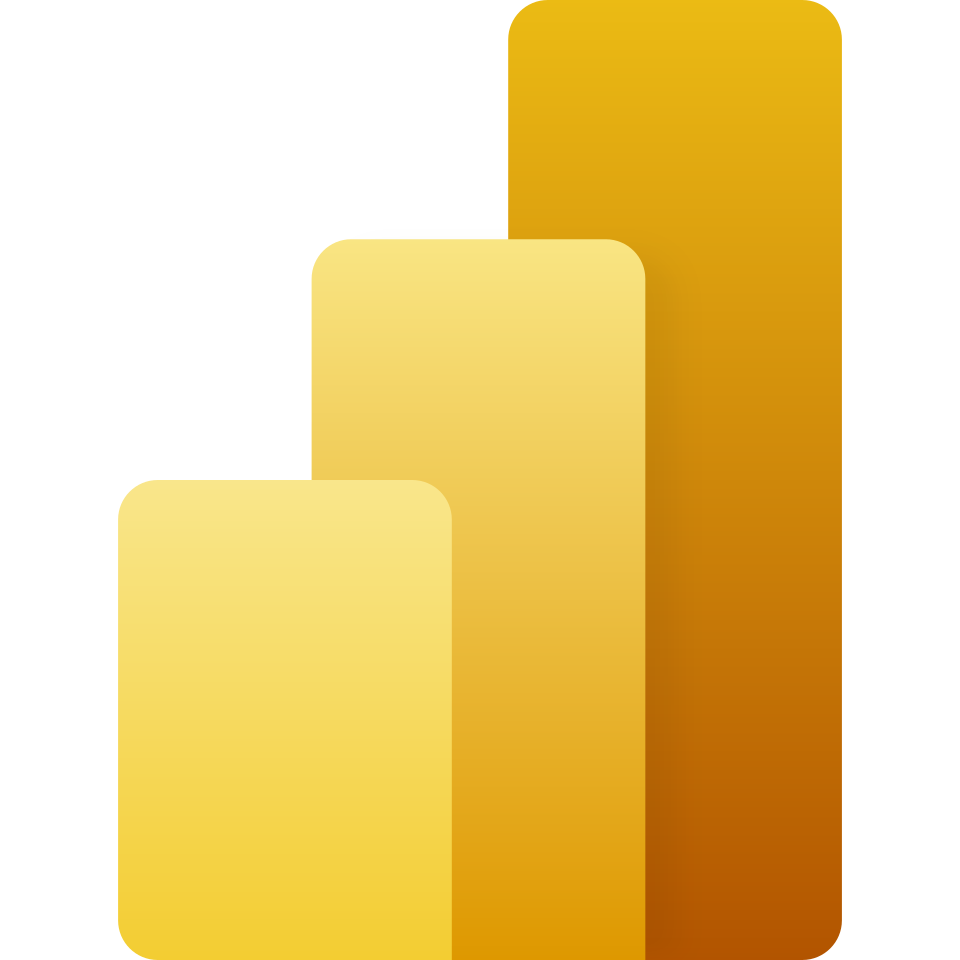

# 👋 Olá, eu sou o Ricardo Maragni

Sou administrador por formação, mas foi na tecnologia que encontrei minha forma favorita de resolver problemas.

Sou criador do **Power Aulas** e apaixonado por transformar processos reais em soluções digitais usando Power Platform, IA e automação.

## 🚀 Sobre mim

* 💼 Trabalho com transformação digital, automações e soluções internas
* 🧩 Crio soluções com Power Apps, Power Automate, Power BI e SharePoint
* 🎓 MBA em Engenharia de Software pela USP
* 📚 Compartilho conhecimento prático através do **Power Aulas**
* 🤖 Interessado em IA aplicada a negócios, produtividade e educação

## 🛠️ Tecnologias e ferramentas

  
  
  
  
  
  
  

## 📌 Conheça um pouco do meu trabalho

## 🌐 Onde me encontrar

  <a href="https://www.linkedin.com/in/ricardo-maragni/">
    
    <strong>LinkedIn</strong>
  </a>
  &nbsp;&nbsp;&nbsp;&nbsp;
  <a href="https://poweraulas.com.br">
    
    <strong>Power Aulas</strong>
  </a>

